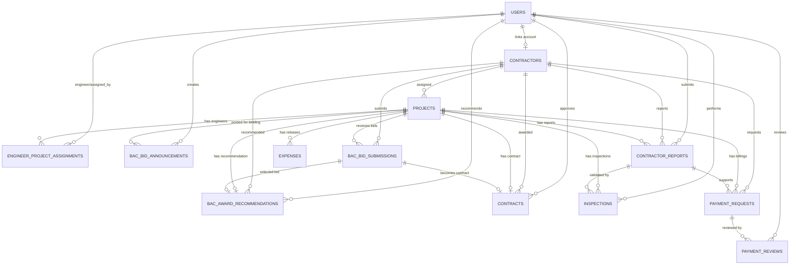

# Database Role Connection Design

This IPMS database connects the four main LGU roles through project-centered tables.

## Role Accounts

The `users` table controls login and role-based access.

- `users.role = 'admin'`: manages projects, approvals, budget, assignments, and dashboard monitoring.
- `users.role = 'bac'`: manages bidding announcements, bid records, and award recommendations.
- `users.role = 'engineer'`: monitors assigned projects, validates progress, and creates inspections.
- `users.role = 'contractor'`: views assigned contracts, submits progress reports, documents, and payment requests.

Contractor users are linked to contractor profiles through `contractors.user_id`.
Engineer access to projects is controlled through `engineer_project_assignments`.

## Main Connected Tables

| Table | Purpose | Main Role |
|---|---|---|
| `users` | Stores login accounts and role values | All roles |
| `contractors` | Stores contractor company/profile data | Admin, Contractor |
| `projects` | Stores LGU infrastructure projects | Admin |
| `engineer_project_assignments` | Assigns engineers to projects | Admin, Engineer |
| `bac_bid_announcements` | Publishes projects for bidding | BAC |
| `bac_bid_submissions` | Stores contractor bid details | BAC, Contractor |
| `bac_award_recommendations` | Stores BAC award recommendations | BAC |
| `contracts` | Stores awarded contract records | Admin, Contractor |
| `contractor_reports` | Stores contractor progress/accomplishment reports | Contractor |
| `inspections` | Stores engineer validation of contractor reports | Engineer |
| `contractor_documents` | Stores supporting files submitted by contractors | Contractor |
| `payment_requests` | Stores contractor billing/payment requests | Contractor |
| `payment_reviews` | Stores engineer/admin payment review decisions | Engineer, Admin |
| `expenses` | Stores released project expenses/payments | Admin |
| `bac_procurement_logs` | Stores procurement activity history | BAC, Admin |

## Important Foreign Keys

```text
contractors.user_id -> users.id

projects.contractor_id -> contractors.id

engineer_project_assignments.engineer_id -> users.id
engineer_project_assignments.project_id -> projects.id
engineer_project_assignments.assigned_by -> users.id

bac_bid_announcements.project_id -> projects.id
bac_bid_announcements.created_by -> users.id

bac_bid_submissions.project_id -> projects.id
bac_bid_submissions.contractor_id -> contractors.id

bac_award_recommendations.project_id -> projects.id
bac_award_recommendations.bid_submission_id -> bac_bid_submissions.id
bac_award_recommendations.contractor_id -> contractors.id
bac_award_recommendations.recommended_by -> users.id

contracts.project_id -> projects.id
contracts.bid_submission_id -> bac_bid_submissions.id
contracts.contractor_id -> contractors.id
contracts.approved_by -> users.id

contractor_reports.project_id -> projects.id
contractor_reports.contractor_id -> contractors.id
contractor_reports.submitted_by -> users.id

inspections.project_id -> projects.id
inspections.progress_report_id -> contractor_reports.id
inspections.engineer_id -> users.id

payment_requests.project_id -> projects.id
payment_requests.contractor_id -> contractors.id
payment_requests.progress_report_id -> contractor_reports.id

payment_reviews.payment_request_id -> payment_requests.id
payment_reviews.reviewed_by -> users.id

expenses.project_id -> projects.id
```

## Database Data Flow

1. Admin creates a project in `projects`.
2. Admin or workflow assigns engineers through `engineer_project_assignments`.
3. BAC publishes approved projects through `bac_bid_announcements`.
4. BAC records contractor bids in `bac_bid_submissions`.
5. BAC recommends the winning bid in `bac_award_recommendations`.
6. The system creates/updates a formal `contracts` row from the recommended bid.
7. Contractor sees assigned/active projects and submits `contractor_reports`.
8. Engineer reviews contractor reports and saves validation in `inspections`.
9. Contractor submits `payment_requests` linked to the latest progress report.
10. Engineer/Admin reviews payment through `payment_reviews`.
11. Admin records actual released amounts in `expenses`.

## Current System Screens Connected To This Design

- BAC portal: creates bidding announcements, bid submissions, award recommendations, and contract records.
- Contractor portal: shows assigned contracts, submits progress reports, uploads documents, and submits payment requests.
- Engineer portal: reviews contractor progress reports through inspections and performs technical payment review.
- Admin portal: shows workflow summaries and includes a Contract & Payment Review page for contracts, inspections, and final payment review.

## Mermaid ERD



## Role-Based Access Control

The application checks `users.role` after login and stores the user in the PHP session.
Each portal then filters records by role-specific ownership:

- Admin can view global workflow summaries.
- BAC can access bidding and award recommendation records.
- Engineer can only access projects listed in `engineer_project_assignments`.
- Contractor can only access projects where `projects.contractor_id` matches their `contractors.id`.

This design keeps the system relational, auditable, and easy to explain for capstone documentation.
